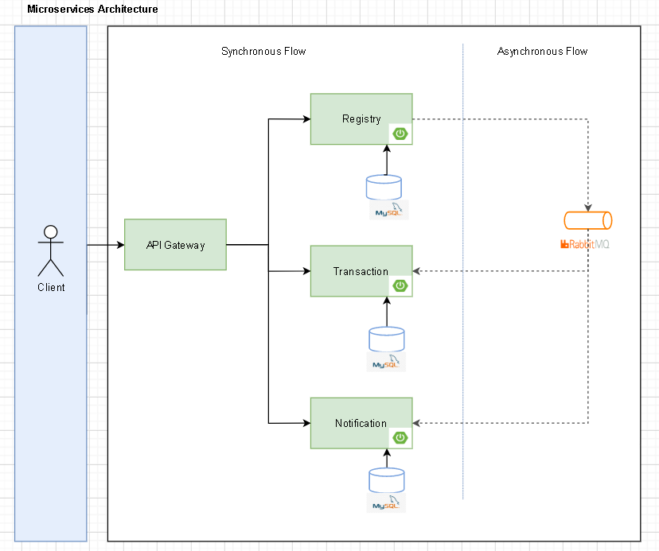
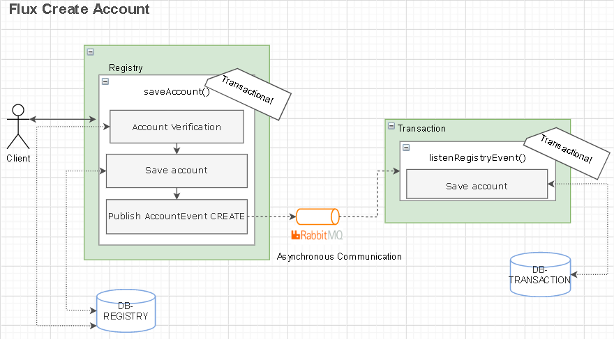
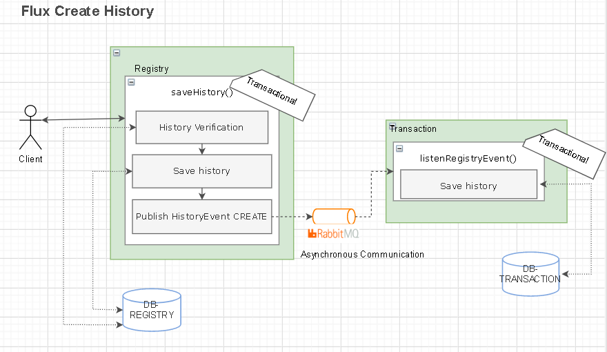
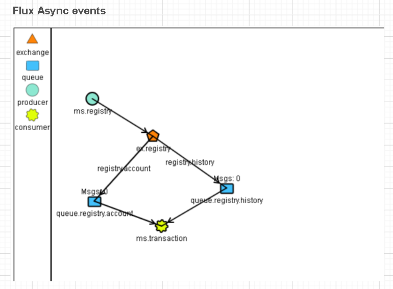

<h1 align="center">
  Bank Project
</h1>

 

Project created to practice knowledge of JAVA, Spring Boot, etc.

These modules are part of a simulation of a banking ecosystem.

---

### Modules:
- Account Registry
- History Registry

## Tecnologias / Libraries

- Spring Boot
- Java 17
- Mysql 8
- RabbitMQ
- MapStruct
- Liquibase
- Lombok

### Ecosystem Architecture

This diagram shows the project ecosystem.

### Module: Account Registry 

This diagram shows the account-registry flux.

### Module: History Registry

This diagram shows the history-registry flux.

### Module: History Registry

This diagram shows the events flux.

